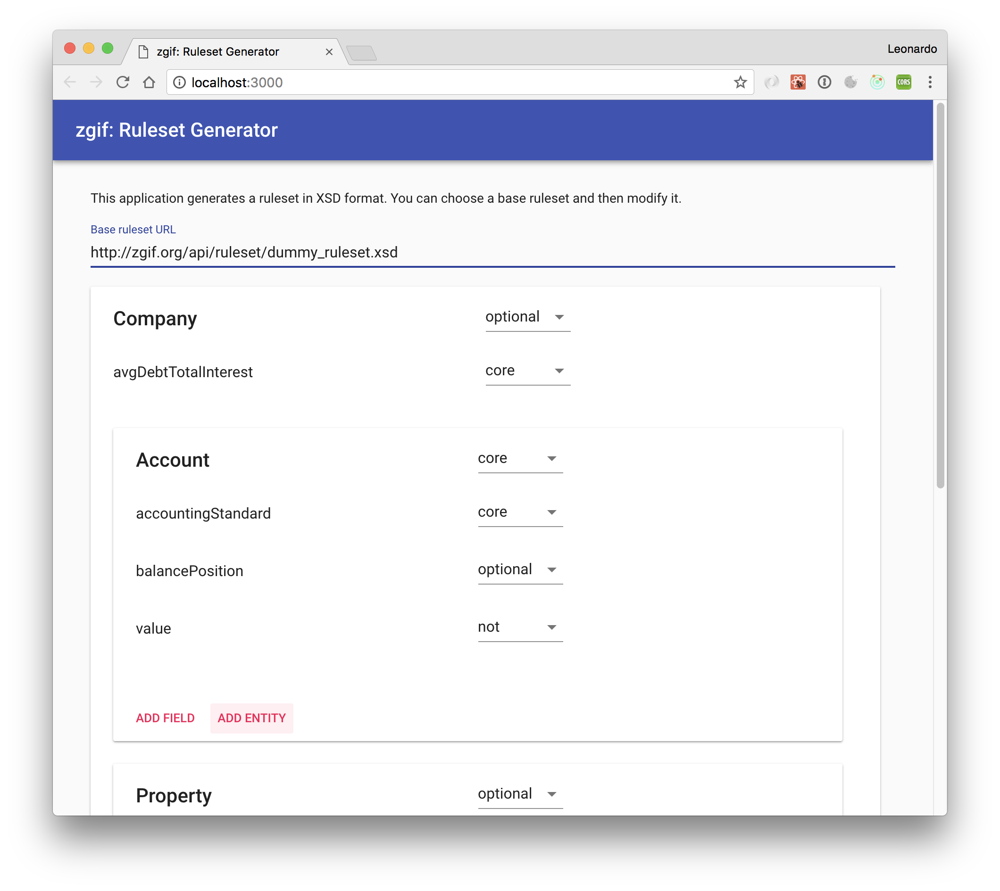
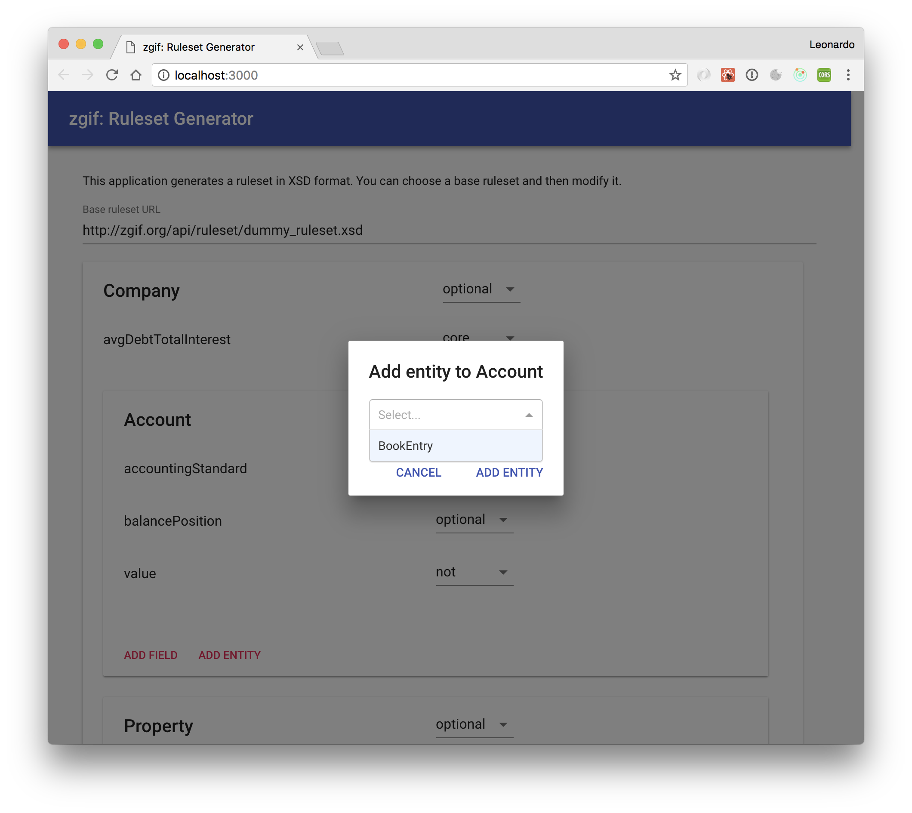

# ruleset-generator

## Installation

From this directory run: `npm install`.

## Execution

From this directory run: `npm start` and an HTTP server will spin up and your browser will open.

## Build for production

Configure the deployment path for the build with in [package.json](package.json) in this directory.
Currently it is set to `"homepage": "/ruleset-generator/"` to meet the zgif.org requirements

From this directory run: `npm run build` to get the build artefact in /build.

## Usage

### Limitations

- This application breaks if the XSD is invalid; e.g. in http://zgif.org/api/ruleset/subset_52.xsd there's no `Account`.
- It's not possible to download with the mocked API
- It's not possible to consume the live API locally unless CORS is disabled in your browser. On Chrome you can achieve that by using [this extension](https://chrome.google.com/webstore/detail/allow-control-allow-origi/nlfbmbojpeacfghkpbjhddihlkkiljbi?hl=en). _Note that you should the extension disables a good security feature of Google Chrome, don't forget to disable the extension after using it._

For a full list of features that are yet to be done, please refer to our `TODO.md` file.

### Instructions

1.  Paste or type a URL pointing to a zgif XSD that should be used as base. E.g. http://zgif.org/api/ruleset/dummy_ruleset.xsd
2.  Change the rule values: core, optional, not
3.  Optionally add new field or entity rules
4.  Click the button "generate ruleset" at the end of the page
5.  A new XSD should be downloaded

## Optional configuration

The app is by default connected to the live API.
Some API endpoints mocks are available for faster development and can be enabled by changing the file `src/config.js`.

## Facts

### Browser support

This tool is currently only tested on the stable release of Google Chrome.
Because of the relatively new features used in this project, other browsers may not work with this at the moment.
Tests and support to other browsers require the addition of polyfills and may be done in the future.

### Technical

- Main technologies: React, Redux, JSX, CSS
- CSS selectors format: BEM
- CSS pre-processor: none
- This project was bootstrapped with [Create React App](https://github.com/facebookincubator/create-react-app).
